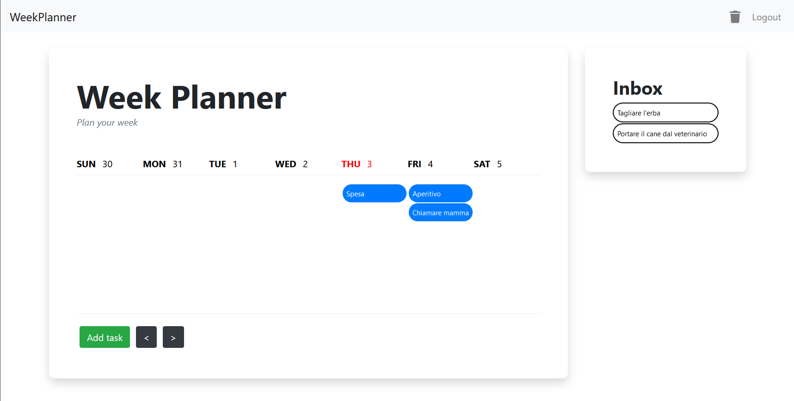

# WeekPlanner



WeekPlanner è un'applicazione realizzata in React, Django e MySQL che permette all'utente di pianificare task da svolgere durante la settimana.

## Features

* **Calendario** per visualizzare i task della settimana
* **Aggiunta/modifica di task** con:
  * Titolo
  * Descrizione
  * Priorità
* **Ripetizione di un task** su più giorni
* **Sistema di autenticazione** (registrazione/login/logout)
* **Inbox**: sezione per task senza un giorno assegnato
* **Trash**: offre la possibilità di ripristinare task precedentemente eliminati

## Come eseguire l'applicazione

Per poter eseguire l'applicazione è necessario installare [Docker](https://www.docker.com/products/docker-desktop).

Una volta clonata la repository, è necessario aggiornare i due file `django.env` e `mysql.env` contenenti le chiavi e le password che si vogliono utilizzare nel sistema.

Infine, è necessario navigare all'interno della cartella principale della repository ed eseguire:

```bash
docker-compose up
```

per far partire l'applicazione.

La web app sarà disponibile su `localhost:3000`.

## Documentazione

[Architettura](https://github.com/damix55/weekplanner/wiki/Architettura)

[Authentication API](https://github.com/damix55/weekplanner/wiki/Authentication-API)

[Registration API](https://github.com/damix55/weekplanner/wiki/Registration-API)

[Schema Logico](https://github.com/damix55/weekplanner/wiki/Schema-Logico)

[Tasks API](https://github.com/damix55/weekplanner/wiki/Tasks-API)

